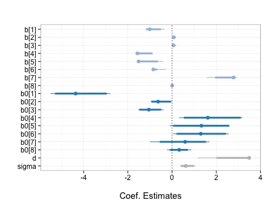

zibHelpers 
===

> Helper functions for handling results from Bayesian Zero-Inflated Beta Regressions in R

Christopher Gandrud

## Description

Contains a number of functions to help diagnose and examine results
from Bayesian zero-inflated beta regressions estimated with the
[zoib](http://cran.r-project.org/web/packages/zoib/index.html) package.

For more information about Bayesian zero-inflated regression see pages 12-14 of
[Liu and Kong](http://www3.nd.edu/~fliu2/JSS_zoib.pdf). This piece has a good
summary of zero/one inflated beta regression generally.

## Functions

- `GelmanDiag`: extract [Gelman-Rubin convergence diagnostics](http://www.people.fas.harvard.edu/~plam/teaching/methods/convergence/convergence_print.pdf)

- `SummaryZib`: extract and summarise posterior distribution

- `zibPlot`: plot parameter posteriors from Zero-inflated Beta Regressions

## Example

```{S}
# Load packages
library(zoib)
library(zibHelpers)

# Run example of clustered zero-inflated beta regression from
# Liu and Kong (under review, 12-14)

# Load data
data("AlcoholUse", package = "zoib")
AlcoholUse$Grade <- as.factor(AlcoholUse$Grade)

nIter = 50 # Number of iterations, including burn-in

# Estimate
Out <- zoib(Percentage ~ Grade + Days + Gender|1|Grade + Days + Gender|1,
            data = AlcoholUse, random = 1, EUID = AlcoholUse$County,
            zero.inflation = TRUE, one.inflation = FALSE, joint = FALSE,
            n.iter = nIter)

# Gelman-Rubin diagnostics
GelmanDiag(Out, nIter)

# Summarise the posterior
SummaryZib(Out, nIter)

# Plot the posterior summary
zibPlot(Out, iter = nIter)
```

`zibPlot` in this example creates the following plot. Note that coefficients are
show in the order in which they are entered into the model. `b*[1]` refers to
the intercepts. Those prefixed with `b` are for the beta continuous part. Those
with `b0` are for the discrete part where the outcome is the probability that
the dependent variable = 0.

You can add custom variable labels with the `xlab` argument.



## Install

```{S}
devtools::github_install('christophergandrud/zibHelpers')
```
---

[](http://nadrosia.tumblr.com/post/53520500877/made-in-berlin-badge-update)

Licensed under
[MIT](LICENSE)
